# 理想国 数据分析 第一次笔记

> 作者: 张大鹏


## `Numpy`

### 001.`arange()`

- 作用:生成一个序列
- 例如:`numpy.arange(10)`

### 002.`Numpy`是什么

- 1.是Python的开源数值计算库

### 003.创建`ndarray`对象

- 1.从Python数据转换过来
- 2.通过Numpy的函数生成
- 3.从文件读取


## `Matplotlib`

### 001.绘制折线图

```python
# -*- coding: utf-8 -*-

import matplotlib.pyplot as plt
plt.plot([1,2,3],[3,2,1])
plt.show()
```

### 002.绘制散点图

- 散点图显示两组数据的值,每个点的坐标位置由变量的位置决定
- 由一组不连接的点完菜,用于观察两种变量的相关性
- 例如身高-体重,温度-维度等
- 数学上,表现的是x变量和y变量的关系
- 编程上,要求两种变量的值组成的列表长度一样,例如`list(x)==list(y)`
- 正相关性,指的是散点图组成一种从左下方到右上方上升的趋势
- 负相关性,指的是散点图组成一种从左上方到右下方下降的趋势

#### 外观调整

- 修改颜色 c
  - r表示红色
  - 参考:``'b', 'g', 'r', 'c', 'm', 'y', 'k', 'w'``
- 修改点大小 s,默认值是20
- 修改透明度 alpha
- 修改点形状 marker
  - 很多种,具体查看官网

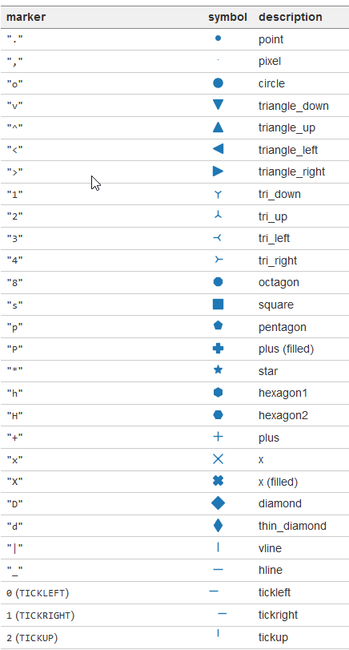

#### 代码实战

**绘制简单的散点图**

```python
# -*- coding: utf-8 -*-
"""
Created on Thu Sep 26 22:09:33 2019

@author: 18010
"""

# 绘制一个简单的散点图
# 1.导入numpy和pyplot
import numpy as np
import matplotlib.pyplot as plt

# 2.准备两个可迭代对象
x=np.random.randint(1,100,20)
y=np.random.randint(100,1000,20)

# 3.调用.scater()方法绘制散点图
plt.scatter(x,y)

# 4.调用.show()方法展示散点图
plt.show()
```

基本步骤

- 1.导入numpy和pyplot
- 2.准备两个可迭代对象
- 3.调用`pyplot.scatter()`方法绘制散点图,参数是两个可迭代对象
- 4.调用`pyplot.show()`方法展示


**绘制两个随机数列表的散点图**

```python
import numpy as np
import matplotlib.pyplot as plt
x=np.random.randn(N)
y1=np.random.randn(len(x))

plt.scatter(x,y1)

plt.show()
```

**股票今天的涨势和明天的涨势散点图**

```Python
# -*- coding: utf-8 -*-
"""
Created on Thu Sep 26 22:14:40 2019

@author: 18010
"""

# 股票今天的涨势和明天的涨势的散点图
# 涨势(rally)=关盘价(close列)-开盘价(open列)
# 1.导入依赖包 numpy pyplot
import numpy as np
import matplotlib.pyplot as plt

# 2.准备两个可迭代对象
# 2.1 读取../../000001.csv,分隔符delimiter为逗号,跳过第一行,使用第1列和第4列,解析
open,close=np.loadtxt('../../000001.csv',delimiter=',',skiprows=1,usecols=(1,4),unpack=True)

# 2.2 涨势rally=close-open
rally=close-open

# 2.3 获取今日涨势和明日涨势 rally[:-1]  rally[1:]
today_rally=rally[:-1]
tomorrow_rally=rally[1:]

# 3.绘制散点图 scatter()
plt.scatter(today_rally,tomorrow_rally)

# 4.展示数据
plt.show()
```

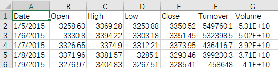

- `delimiter`表示分隔符
- `skiprows=1`表示跳过第一行
- `usecols=(1,4)`表示使用第1列和第4列
- `unpack=True`表示使用解析

- `change=close-open`是因为,`numpy`读取到的数据可以直接做算术运算,结果类型不变
- `yesterday=change[:-1]`表示从第一个到倒数第一个为昨天
- `today=change[1:]`表示从第二个到最后一个为今天
- 这里,昨天和今天得到的可迭代对象的长度是一样的,可以做散点图
- `plt.scatter(today,yesterday)`,绘制散点图,只要传入两个可迭代对象即可

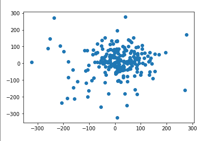


**外观调整散点图**

```Python
# -*- coding: utf-8 -*-
"""
Created on Thu Sep 26 22:14:40 2019

@author: 18010
"""

# 股票今天的涨势和明天的涨势的散点图
# 涨势(rally)=关盘价(close列)-开盘价(open列)
# 1.导入依赖包 numpy pyplot
import numpy as np
import matplotlib.pyplot as plt

# 2.准备两个可迭代对象
# 2.1 读取../../000001.csv,分隔符delimiter为逗号,跳过第一行,使用第1列和第4列,解析
open,close=np.loadtxt('../../000001.csv',delimiter=',',skiprows=1,usecols=(1,4),unpack=True)

# 2.2 涨势rally=close-open
rally=close-open

# 2.3 获取今日涨势和明日涨势 rally[:-1]  rally[1:]
today_rally=rally[:-1]
tomorrow_rally=rally[1:]

# 3.绘制散点图 scatter()
plt.scatter(today_rally,tomorrow_rally,c='r',s=100,marker='o')

# 4.展示数据
plt.show()
```

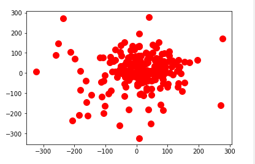

### 003.绘制折线图

#### 概念

- 折线图是用直线段将各数据连接起来组成的图形
- 常用来观察数据随时间变化的趋势
- 例如股票价格,温度变化,等等

**简单折线图**

```python
# -*- coding: utf-8 -*-
"""
Created on Fri Sep 27 08:39:33 2019

@author: 18010
"""

# 绘制简单折线图
# 1.导入包numpy,pyplot
import numpy as np
import matplotlib.pyplot as plt

# 2.准备数据,横轴和纵轴,一般是x和y的函数关系
x=np.linspace(1,100,20)
print(x)
y=x**2

# 3.绘制折线图,用plot方法(散点图用scatter方法)
plt.plot(x,y)

# 4.显示折线图 show方法
plt.show()
```

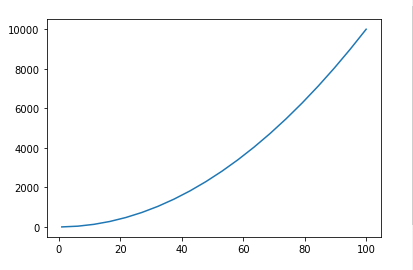

#### 股票涨势图案例

```python
# _*_ coding:UTF-8 _*_
# 开发人员: 理想国真恵玩-张大鹏
# 开发团队: 理想国真恵玩
# 开发时间: 2019/9/27 9:01
# 文件名称: hw004_绘制股票开盘价与收盘价与时间关系图.py
# 开发工具: PyCharm

# 1.导入包numpy,matplotlib.pyplot,matplotlib.dates
import numpy as np
import matplotlib.pyplot as plt
import matplotlib.dates as mdates
import pandas as pd
# 根据提示
from pandas.plotting import register_matplotlib_converters

register_matplotlib_converters()

# 2.读取csv文件,loadtxt
df = pd.read_csv('stock.csv')
# print(type(df))
# print(df.info())
# print(df[['Date', 'Open', 'Close']])
# date, open, close = df[['Date', 'Open', 'Close']]
# print(date, type(date))
date = df['Date']
# print(type(date))
# print(date)
open = df['Open']
close = df['Close']
# 2.2 绘制折现图,关于时间,用pyplot.plot_date(横轴序列,纵轴序列,'-')
plt.plot_date(date, open, '-', c='g')
plt.plot_date(date, close, 'y-', c='r')

# 3.显示折线图
plt.show()
```

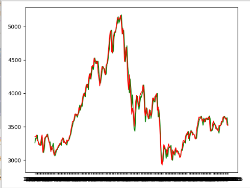

### 004.绘制条形图

#### 概念

- 以长方形长度为变量的统计图表
- 用来比较多个项目分类的数据大小
- 常用于较小的数据集分析
- 例如不同季度的销量,不同国家的人口等
- 用`pyplot.bar`方法进行绘制

#### 简单条形图

```python
# _*_ coding:UTF-8 _*_
# 开发人员: 理想国真恵玩-张大鹏
# 开发团队: 理想国真恵玩
# 开发时间: 2019/9/27 10:22
# 文件名称: hw007_简单条形图.py
# 开发工具: PyCharm

# 1.导入包 numpy matplotlib.pyplot
import numpy as np
import matplotlib.pyplot as plt

# 2.生成数据,横坐标,纵坐标
x = np.arange(10)
y = np.random.randint(10, 30, 10)

# 3.绘制条形图 .bar(横坐标,纵坐标,width=宽度,color=颜色)
plt.bar(x, y, width=.5, color='red')

# 4.展示图像
plt.show()
```

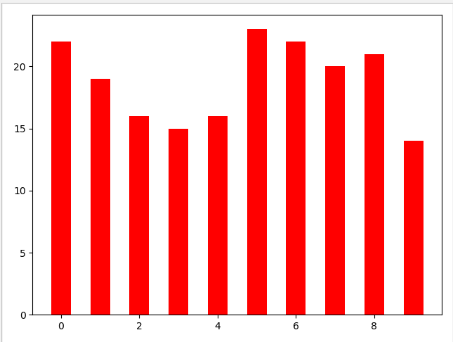

#### 水平条形图

```python
# _*_ coding:UTF-8 _*_
# 开发人员: 理想国真恵玩-张大鹏
# 开发团队: 理想国真恵玩
# 开发时间: 2019/9/27 10:28
# 文件名称: hw008_垂直条形图.py
# 开发工具: PyCharm

# 1.导入包
import numpy as np
import matplotlib.pyplot as plt

# 2.准备数据
x = np.arange(10)
y = np.random.randint(5, 30, 10)

# 3.画图
plt.barh(x, y, .5)

# 4.展示
plt.show()
```

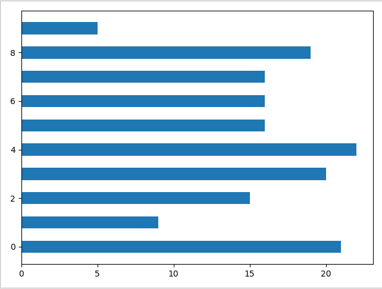

#### 并列条形图

- 原理:让从2列开始的条形图,x方向进行偏移

```python
# _*_ coding:UTF-8 _*_
# 开发人员: 理想国真恵玩-张大鹏
# 开发团队: 理想国真恵玩
# 开发时间: 2019/9/27 10:36
# 文件名称: hw009_并列条形图.py
# 开发工具: PyCharm
import numpy as np
import matplotlib.pyplot as plt

x = np.arange(10)
y1 = np.random.randint(5, 50, 10)
y2 = np.random.randint(5, 50, 10)

# 关键技术
# 1.设置bar宽度
# 2.让y2的x加上宽度
bar_width = .3
plt.bar(x, y1, bar_width, color='b')
plt.bar(x + bar_width, y2, bar_width, color='r')

plt.show()
```

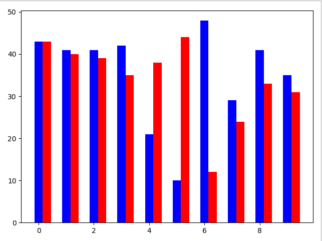

#### 堆叠条形图

- 原理:让一种小的条形图在下面,大的在上面,形成一种覆盖效果,这样,超出的部分就一目了然

```python
# _*_ coding:UTF-8 _*_
# 开发人员: 理想国真恵玩-张大鹏
# 开发团队: 理想国真恵玩
# 开发时间: 2019/9/27 10:41
# 文件名称: hw010_堆叠条形图.py
# 开发工具: PyCharm

import numpy as np
import matplotlib.pyplot as plt

x = np.arange(10)
y1 = np.random.randint(1, 50, 10)
y2 = np.random.randint(1, 50, 10)

# 关键结束
# 1.水平方向不偏移
# 2.设置bottom属性,告知谁在底部
plt.bar(x, y1, .3, color='r')
plt.bar(x, y2, .3, color='b', bottom=y1)

plt.show()
```

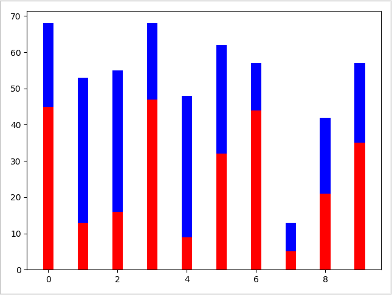


### 005.绘制直方图

#### 概念

- 由一系列高度不等的纵向条形组成,表示数据分布的情况
- 例如某年级同学的身高分布情况
- 注意和条形图的区别
  - 条形图适合小数据
  - 一般是自己和自己比
  - 比如每季度的销量


#### 关键技术

- `hist`用来画直方图
  - `x`表示数据集
  - `bins`分割成几个,表示的是分组
    - 分组越多,越趋近于一条曲线
  - `color`颜色是什么
  - `normed`是否标准化
    - True:纵坐标会变成频率
    - False:纵坐标表示数据个数

- `hist2d`用来画双变量直方图,也就是2D图形
  - 一般用来探索双变量的联合分布


#### 基本步骤

```
1.导入包 numpy  matplotlib.pyplot
2.准备数据 正态分布数据生成公式  x=均值+方差*numpy.random.rand(数据个数)
3.画图 pyplot.hist(正太分布的数据集,bins=划分成多少份,density=是否标准化输出,color=颜色)
3.展示 pyplot.show()
```


#### 简单的直方图

```python
# _*_ coding:UTF-8 _*_
# 开发人员: 理想国真恵玩-张大鹏
# 开发团队: 理想国真恵玩
# 开发时间: 2019/9/27 21:06
# 文件名称: hw_014_绘制简单直方图.py
# 开发工具: PyCharm

import numpy as np
import matplotlib.pyplot as plt

# 生成均值为100,方法是20的2000个随机数
x = 100 + 20 * np.random.randn(2000)
# print(x)

plt.hist(x, bins=10, color='r', density=True)

plt.show()
```

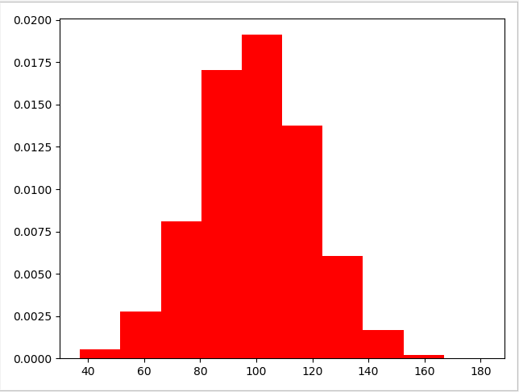

### 006.绘制饼状图

#### 概念

- 饼状图显示一个数据系列中各项的大小与各项总和的比例
- 饼状图中的数据点显示为整个饼状图的百分比
- 例如:前十大品牌占市场份额图

#### 关键技术

- `pie`用来画饼图
  - `explode`表示距离圆心的距离,用来突出显示
  - `shadow`是否显示阴影
  - `labels`标签
  - `autopct`格式化标签

#### 基本步骤

- 1.引入包 `matplotlib.pyplot`
- 2.准备数据,是一个可迭代对象
- 3.准备突出显示和标签的元组
- 4.设置正圆(可选):`pyplot.axes(aspect=1)`
- 5.`pyplot.pie(数据,labels=标签,autopct=格式化字符串,shadow=是否显示阴影,explode=突出显示)`

#### 简单的饼图

```python
# _*_ coding:UTF-8 _*_
# 开发人员: 理想国真恵玩-张大鹏
# 开发团队: 理想国真恵玩
# 开发时间: 2019/9/28 8:06
# 文件名称: hw_015_简单饼状图.py
# 开发工具: PyCharm

import matplotlib.pyplot as plt

# 表示标签
labels = 'A', 'B', 'C', 'D'
frace = [15, 234, 234, 123]
# 表示距离圆心的距离
explode = (0, 0.05, 0, 0)
# 如果需要饼图为正圆
plt.axes(aspect=1)
plt.pie(frace, explode=explode, labels=labels, autopct='%.2f%%', shadow=True)
plt.show()
```

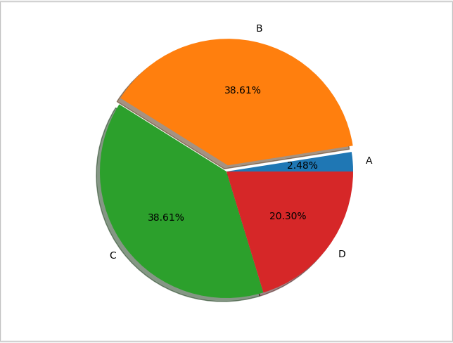

### 007.箱线图

#### 概念

- 是一种用做显示一组数据分散情况资料的统计图
- 上边缘,上四分位数,中位数,下四分位数,下边缘,异常值

#### 关键技术

- `pyplot.boxplot()`用来画箱线图
  - 数据是一组可迭代对象
  - `sym`:用来调整异常点的形状
  - `whis`:代表虚线的长度
    - 默认值是1.5
- `numpy.random.normal()`
  - `size=(1000,4)`表示四组数据,每组1000个值

#### 简单箱线图

```python
# _*_ coding:UTF-8 _*_
# 开发人员: 理想国真恵玩-张大鹏
# 开发团队: 理想国真恵玩
# 开发时间: 2019/9/28 8:54
# 文件名称: hw_017_绘制箱线图.py
# 开发工具: PyCharm

import numpy as np
import matplotlib.pyplot as plt

# 设置随机数种子,让随机数变得稳定
np.random.seed(100)
# 生成1000个符合正太分布的向量
data = np.random.normal(size=1000, loc=0.0, scale=1.0)
# 绘制箱线图
plt.boxplot(data, sym='o', whis=1.5)
plt.show()
```

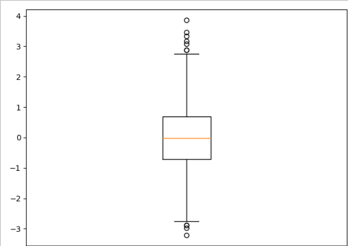

#### 多箱线图

```python
# _*_ coding:UTF-8 _*_
# 开发人员: 理想国真恵玩-张大鹏
# 开发团队: 理想国真恵玩
# 开发时间: 2019/9/28 9:05
# 文件名称: hw_018_多箱线图.py
# 开发工具: PyCharm

import numpy as np
import matplotlib.pyplot as plt

# 生成100x4的正太矩阵
np.random.seed(100)
data = np.random.normal(size=(100, 4), loc=0.0, scale=1.0)
# print(data)

labels = ['A', 'B', 'C', 'D']
plt.boxplot(data, labels=labels)
plt.show()
```

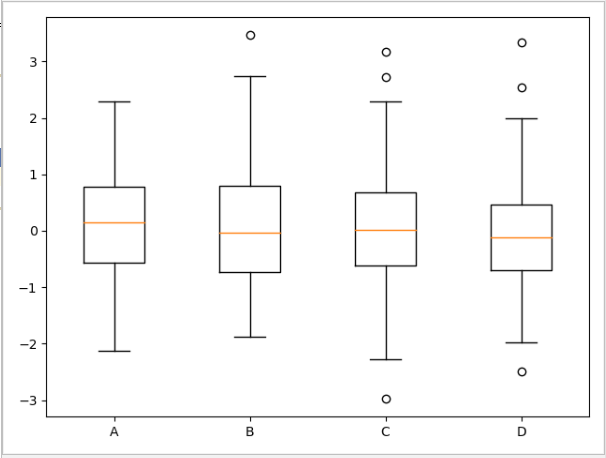

